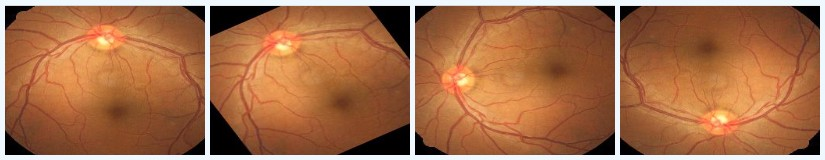
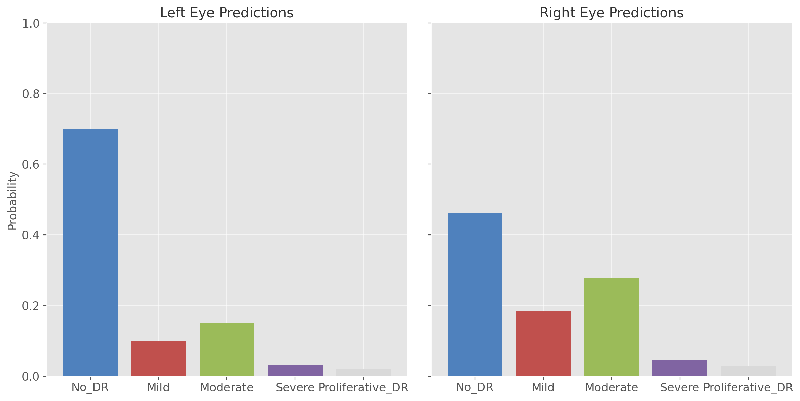

# Diabetic Retinopathy Detection Using Deep Learning

## Authors:
- Aditya Singh Golia
- Satvik Pandey

## Project Description
This project aims to detect Diabetic Retinopathy (DR) using deep learning models based on Convolutional Neural Networks (CNNs). DR is a leading cause of blindness, affecting diabetic patients worldwide. The project uses a dataset of retinal fundus images and applies various preprocessing techniques followed by deep learning models to classify the severity of DR. The models are then integrated into a web application for easy access and real-time detection.

## Methodology
1. **Exploratory Data Analysis (EDA):**
   - Conducted EDA to examine class imbalance and overall dataset characteristics. Images were preprocessed by cropping, resizing, and augmenting (rotation, mirroring) to balance the dataset and make it more suitable for training.
   
2. **Image Preprocessing:**
   - Steps include cropping images to a resolution of 1800x1800, resizing them to 512x512 and 256x256, and performing data augmentation. Totally black or incomplete images were removed to improve training quality.

3. **Model Pipeline:**
   - **Model 1 (EyeNet - Custom CNN):** Developed a custom CNN with three convolutional layers. However, the performance was moderate with accuracy around 80%, so this model was scrapped.
   - **Model 2 (Pre-trained CNNs):** Various pre-trained models such as AlexNet, VGGNet, GoogleNet, and ResNet were employed to improve accuracy. Hyperparameter tuning improved the models, but they were prone to overfitting, particularly on unseen data.
   - **Model 3 (Ensemble Model):** The final approach was to ensemble five pre-trained models (ResNet50, InceptionV3, Xception, DenseNet121, and DenseNet169). This model produced the best results, with improved accuracy, precision, recall, and F1-scores across all DR severity classes.

4. **Web Application Implementation:**
   - A Flask-based web app was developed to allow users to upload retinal images and receive real-time predictions on the severity of DR. The web app uses the ensemble model for predictions.

## Project Structure
- `Code/`:
   - `Model 1 - CNN.py`: Contains the custom CNN (EyeNet) implementation.
   - `Model 2 - Pre Trained.py`: Pre-trained models like AlexNet, VGGNet, ResNet, etc.
   - `Model 3 - Ensemble.py`: Ensemble model using multiple pre-trained CNNs.
   - `Preprocessing.py`: Preprocessing script for data augmentation and preparation.

- `Images/`:
   - Contains sample output images from the models, EDA visuals, and performance metrics.
   
- `Report/`:
   - Includes the detailed project report explaining the methodologies and results.

## Requirements
- Python 3.9+
- TensorFlow
- Keras
- Pandas
- OpenCV
- Flask
- Scikit-learn
- Matplotlib
- Seaborn

## Results

Before:

After:

The Ensemble model (Model 3) achieved the highest accuracy and F1-score, making it the best model for detecting the severity of Diabetic Retinopathy. The model can classify DR into five categories: No DR, Mild, Moderate, Severe, and Proliferative DR (PDR).

| Class | Recall | Precision | F1-Score | Specificity | Accuracy |
| --------- | ------- | ---------- | -------- | ------------ | --------- |
| No DR     | 0.97    | 0.84       | 0.90     | 0.40         | 96.12%    |
| Mild DR   | 0.80    | 0.51       | 0.15     | 0.99         | 91.47%    |
| Moderate  | 0.41    | 0.65       | 0.50     | 0.95         | 86.45%    |
| Severe    | 0.51    | 0.48       | 0.49     | 0.98         | 92.71%    |
| PDR       | 0.56    | 0.69       | 0.62     | 0.99         | 93.54%    |

This is how the result looks after we input left and right eye images

## Conclusion
This project successfully demonstrates the use of deep learning models for detecting Diabetic Retinopathy (DR) from retinal fundus images. The Ensemble model, which combines ResNet50, InceptionV3, Xception, DenseNet121, and DenseNet169, outperformed individual models in accuracy, precision, and recall, particularly for severe DR stages. Integrating the model into a Flask web application enables real-time detection, making it a valuable tool for early diagnosis in resource-limited areas. This capability can significantly aid in mass screening efforts, helping to prevent vision loss through early intervention.

Despite the success, there are areas for improvement. The Ensemble model's high computational requirements limited training to 20 epochs, and performance on moderate DR cases could be enhanced with additional tuning and more diverse data. Future work could focus on optimizing the model for better efficiency, reducing overfitting, and improving real-world applicability. Expanding the web application for wider deployment would also increase its utility in clinical and remote settings.

## Further Improvements:
1. **Tuning of hyperparameters:** Further refining the hyperparameters could improve accuracy, particularly for moderate DR cases.
2. **Testing on unseen data:** More extensive testing on unseen data to ensure real-world applicability.
3. **Model Optimization:** Explore adding other models to the Ensemble or replacing existing ones for better training time and memory efficiency.
4. **New Model Implementaion:** Worked on this project in 2021, there have likely been many new and exciting ways to go about this now, look for those and implement it accordingly.

